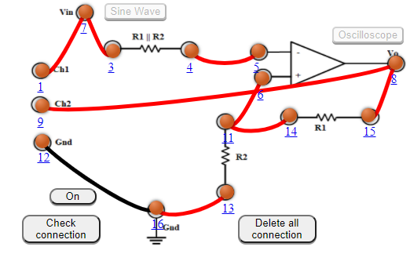

## Procedure

1. Connect the components as mentioned below:
 L1-L7 or L1-L3 , L3-L7, L4-L5, L6-L11 or L6-L14, L8-L15, L12-L16, L8-L9, L13-L16, L14-L11.(For eg. click on 1 and then drag to 3 and so on.)
2. Click on 'Check Connection' button to check the connections.
3. If connected wrong, click on the wrong connection. Else click on 'Delete all connection' button to erase all the connections.
4. Click on 'ON' button to start the experiment.
5. Click on 'Sine Wave' button to generate input waveform (10 Vp-p, 1kHz)
6. Click on 'Oscilloscope' button to get the output waveform.
7. Vary the Amplitude, Frequency, volt/div using the controllers.
8. Click on "Dual" button to observe both the waveform.
9. Channel 1 shows the input sine waveform, Channel 2 shows the output square waveform.
10. Click on "X-Y" button to observe the Hysteresis curve.

#### Note:
1. The input sine wave is 10 Vp-p, 1kHz
2. As, volt/div is set to 1 volt/div. As the Volts/Div is too low, you’ll clip the signal. So, change the volt/div and set to 5 volt/div. Which implies each mazor division is 5 volt where as each minor division is 1volt.
3. Click on oscilloscope. This will give square wave.
4. As, volt/div is set to 1 volt/div. As the Volts/Div is too low, you’ll clip the signal. So, change the volt/div and set to 5 volt/div. Which implies each mazor division is 5 volt where as each minor division is 1volt.
5. Click on "Channel 1" or "Channel 2" button to observe either the input waveform or output waveform.
6. Click on "Dual" button to observe both the waveform
7. Click on "X-Y" button to observe the Hysteresis curve. (X-Y mode is a specialized two-channel mode of oscilloscopes when the signal of channel 1 is used for the deviation along the horizontal axis (X) and the signal of channel 2 – along the vertical axis (Y).)