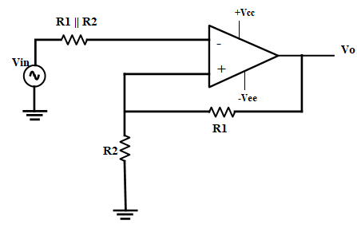

## Theory 

In electronics, a Schmitt trigger is a comparator circuit. It adds hysteresis to the input-output transition threshold by applying positive feedback. Hysteresis means providing two different threshold voltage levels for rising and falling edge. It is used to remove noise from an analog signal while converting it to a digital signal.

#### Op Amp based Schmitt Trigger Circuits

Schmitt trigger is a circuit which converts irregular shaped waveform into square or pulse. This circuit is also called as squaring circuit. A Schmitt trigger circuit is essentially an amplifier with positive feedback, it is possible to implement this setup using operational amplifiers. Depending on where the input is applied, the Op-Amp based circuits can be further divided into Inverting and Non-Inverting Schmitt Triggers.

#### Inverting Schmitt Trigger Circuit

In an Inverting Schmitt Trigger, the input is applied to the inverting terminal of the Op-Amp. In this mode, the output produced is of opposite polarity. This output is applied to non-inverting terminal to ensure positive feedback.

Figure

From the circuit:

When Vinis slightly greater than Vref, the output becomes -Vsat and if Vin is slightly less that -Vref more negative than -Vref, then output becomes Vsat. Hence, the output voltage Vo is either at Vsat or -Vsat and the input voltage at which these state changes occur can be controlled using R1 and R2.    
The values of Vref and -Vref can be formulated as follows:

$$ V_{ref}= \frac{R_1}{(R_1+R_2)} \times (V_{o}) $$

where, Vo=Vsat
- $$ V_{ref}= \frac{R_1}{(R_1+R_2)} \times (-V_{o}) $$ 

where, Vo= -Vsat
Vref is the upper threshold voltage VUTP and -Vref is the lower threshold voltage VLTP

#### Inverting Schmitt Trigger with Hysteresis

Hysteresis can be defined as when the input is higher than a certain chosen threshold (UTP), the output is low. When the input is below a threshold (LTP), the output is high; when the input is between the two, the output retains its current value. This dual threshold action is called hysteresis. This can be understood in the usual sense – the x axis is the input and y axis is the output. Tracing a line from x to y, we find that once the lower threshold has been crossed, the hysteresis goes high and vice versa.

Hysteresis = (VUTP) - (VLTP)

When two levels are to be compared there may be oscillation (or hunting) at the border. Having hysteresis, oscillation problem is solved. The comparator compares always with a fixed reference voltage (single reference) whereas Schmitt trigger compares with two different voltages called UTP and LTP.

#### Applications

1. Schmitt Trigger is used to convert Sine waves into Square waves.
2. They can be used to eliminate chatter in Comparators (a phenomenon where multiple output transitions are produced due to swinging of input signal through the threshold region).
3. They can also act as simple ON / OFF Controllers (for example, temperature based switches).

